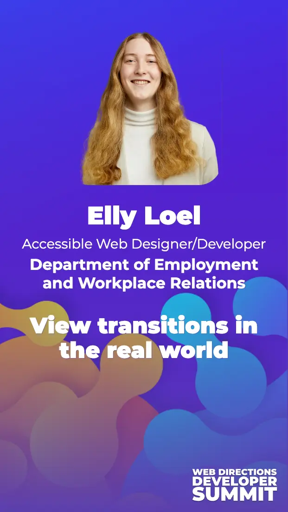

<picture>
	<source
		srcset="../../../assets/img/wdds24-horizontal.webp"
		media="(min-width: 48em), (orientation: landscape) and (min-width: 30em)" />
	
</picture>

## Recording

You can check out the recording with this [free gift link for the recording on Conffab](https://conffab.com/presentation/view-transitions-in-the-real-world/?gl=Itwj2gUPDTjo). The recording also has closed captions and a transcript. There's no separate audio description track but I did my best to make sure I was describing everything as best I could during the talk.

## [Slide view](https://view-transitions-irl.netlify.app/slides/0-hello/)

	<iframe title="Side view" src="https://view-transitions-irl.netlify.app/slides/0-hello/" data-zoom style="aspect-ratio: 16/9; --zoom: 40%"></iframe>

## [Presenter view](https://view-transitions-irl.netlify.app/)

	<iframe title="Presenter view" src="https://view-transitions-irl.netlify.app/" style="aspect-ratio: 1"></iframe>

